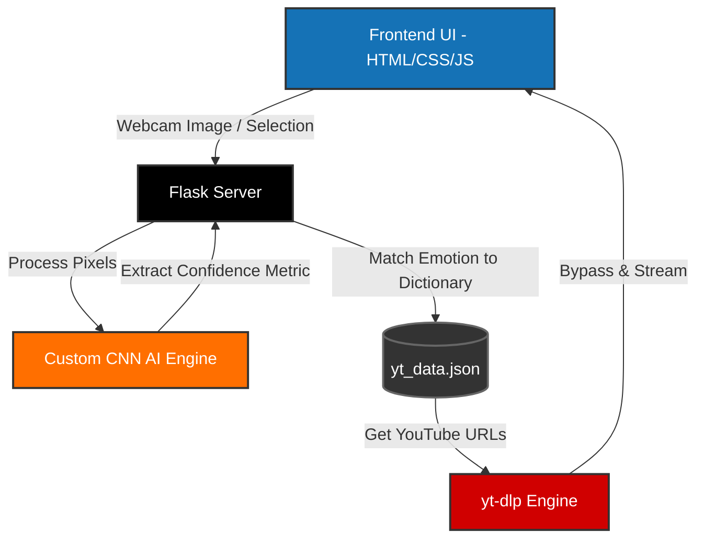

<div align="center">

# MoodX - Emotion-Based Music Recommendation AI

With the rise of personalized music streaming services, there is a growing need for systems that can recommend music based on users' emotional states. Realizing this need, **MoodX** is being developed by **Mohit Kumar** to provide highly personalized, real-time music recommendations based on your detected facial emotions.


</div>

The **MoodX** project is an integrated emotion-based music recommendation engine that combines frontend styling, local Flask backend routing, and deep learning AI models to provide precise audio curation. The application analyzes live facial expressions and synthesizes the exact audio library that aligns with the detected user input.

Supporting seamless desktop execution, MoodX offers an aesthetic, glassmorphic UI with real-time emotion detection mapping directly to a YouTube backend playback system. The project leverages **HTML5/CSS3** for the frontend, **Flask** for the backend engine, and a custom-trained **Convolutional Neural Network (CNN)** for emotion detection. 

<div align="center">


</div>

> [!CAUTION]
> **Important Alert**  
> Be aware that there may be fake accounts claiming ownership of this specific engine structure. I am the sole developer "Mohit Kumar" on GitHub.
> - Always verify you're interacting with this official repo.

<br>

## Table of Contents

- [🎵 Overview](#-overview)
- [🌟 Features](#-features)
- [🛠️ Technologies](#️-technologies)
- [📂 Complete File Structure](#-complete-file-structure)
- [⚙️ Getting Started](#️-getting-started)
- [📋 System Architecture](#-system-architecture)

---

## 🎵 Overview

MoodX provides personalized music recommendations natively processed from visual facial inputs. It interacts heavily with a local Flask backend and an AI/ML Keras model wrapper to extract high-confidence arrays and instantly stream 100% full-length soundtracks matching that frequency.

---

## 🌟 Features

The MoodX project aims to provide the following features:

- Emotion-based music recommendations triggered via Live Webcam feeds or Static Image Uploads.
- `yt-dlp` native integration, fetching completely unrestricted full-length background audio tracks natively bypassing API blockers.
- Exclusive Audio Environment logic preventing track overlap and guaranteeing single-stream clarity.
- Dynamic Aurora background environments with smart-scrolling sticky navigation menus.
- Privacy-first infrastructure executing `model.h5` neural compilations entirely locally.
- Real-time native JS waveform visualizers representing deep learning engine shifts.
- Progressively styled glassmorphism grid layouts holding emotion confidence intervals perfectly.

---

## 🛠️ Technologies

Here is the list of technologies heavily utilized in building the MoodX project:

**Frontend:**
- **HTML5:** For building the underlying semantic user interface.
- **Vanilla Vanilla CSS3:** For advanced glassmorphic styling, animation keyframes, CSS Grid routing, and responsive mobile flexboxes. 
- **JavaScript (ES6):** For real-time canvas manipulations, webcam access routing, and overlapping audio handlers.

**Backend:**
- **Python:** For data-wrangling, image manipulation, and routing.
- **Flask:** For serving the AI/ML application natively and establishing frontend `<->` backend RESTful data pipelines.
- **yt-dlp:** For real-time, zero-API dependency, full-audio stream parsing directly from CDN architectures.

**AI/ML Models:**
- **Custom CNN Architecture:** Hand-trained convolutional layers optimized for high-precision micro-expression parsing.
- **TensorFlow / Keras:** The foundational ML backend mapping weights securely onto local CPU arrays.
- **OpenCV:** For rapid matrix video feed handling (Webcam processing).
- **Pillow (PIL):** For secure matrix conversion prior to neural mapping.

---

## 📂 Complete File Structure

```text
ai_project/
│
├── app.py                 # Core routing and deep learning logic execution
├── model.h5               # Stored neural network compilation architectures
├── yt_data.json           # Local database mapping emotions safely to track IDs
├── test_webcam.py         # Sandbox tool for OpenCV integration testing
├── requirements.txt       # Necessary python packaging execution definitions
│
├── static/
│   ├── styles.css         # The master stylesheet controlling UI dynamics
│   └── uploads/           # Ephemeral storage location for CV2 predictions
│
└── templates/
    ├── index.html         # Homepage and core application entrypoint
    ├── detect.html        # Live camera scanning UI
    └── result.html        # Dashboard generating playlists
```

---

## 📋 System Architecture Overview



---

## ⚙️ Getting Started

Follow these steps to deploy MoodX onto your local hardware.

### 1. Prerequisites
Ensure you have the following installed natively:
- **Python** (Specifically `3.8 - 3.10` for TensorFlow compatibilities).
- **Git**

### 2. Setup Virtual Environment
It is highly recommended to segregate the Machine Learning packages into an isolated virtual environment.

**Windows:**
```bash
python -m venv my_envgpu
.\my_envgpu\Scripts\activate
```

### 3. Install Dependencies
```bash
pip install Flask opencv-python tensorflow yt-dlp
```

### 4. Launch the Server
```bash
python app.py
```
After executing, navigate your browser to `http://127.0.0.1:5000` to interact with the visual engine!
